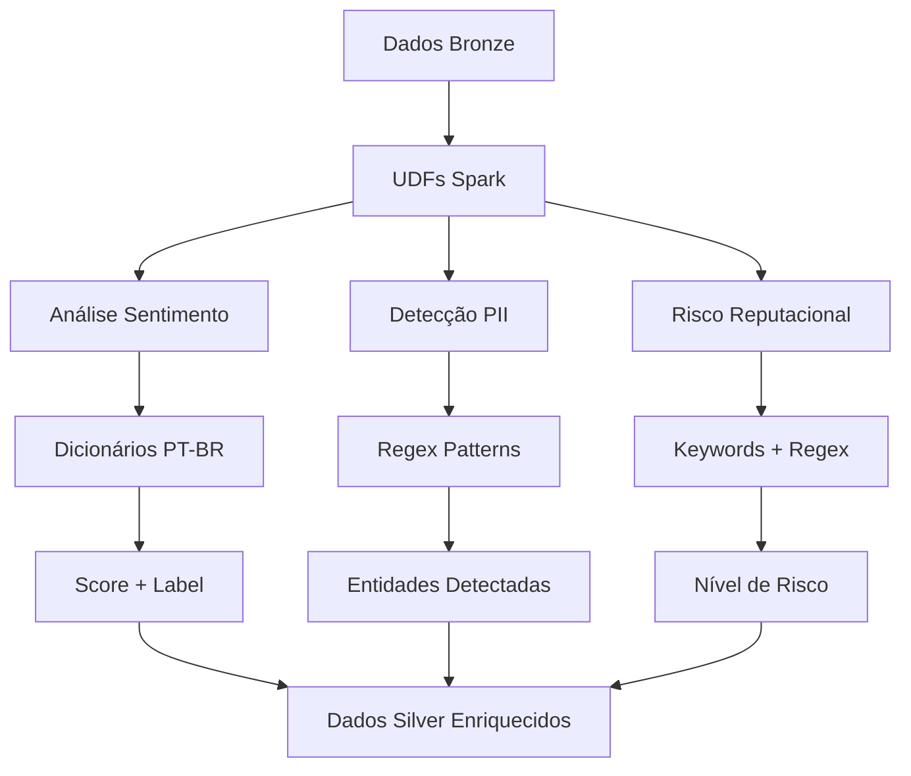

# 🧠 Análise de Sentimentos - DataMaster


Este documento detalha a implementação completa do módulo de NLP (Natural Language Processing) para análise de sentimentos em português brasileiro, detecção de PII e análise de risco reputacional.

---

## 📋 Índice

- [🎯 Visão Geral](#-visão-geral)
- [🔧 Implementação Técnica](#-implementação-técnica)
- [🤖 Modelos Utilizados](#-modelos-utilizados)
- [🔒 Detecção e Anonimização PII](#-detecção-e-anonimização-pii)
- [⚠️ Análise de Risco Reputacional](#️-análise-de-risco-reputacional)
- [📊 Métricas e Validação](#-métricas-e-validação)

---

## 🎯 Visão Geral


### Objetivo do Módulo NLP

O módulo de análise de sentimentos processa avaliações de clientes das agências Santander, extraindo insights valiosos para:

- **Análise de Sentimento:** Classificação automática (Positivo/Negativo/Neutro)
- **Detecção PII:** Identificação de dados pessoais sensíveis
- **Anonimização:** Remoção/mascaramento de informações pessoais
- **Risco Reputacional:** Detecção de problemas críticos de atendimento

### Pipeline NLP no Contexto Geral




---

## 🔧 Implementação Técnica


### UDF Spark Principal 

**Implementação:** [`bronze_to_silver_fixed.py`](../mnt/spark/jobs/bronze_to_silver_fixed.py)

```python
# NOTA: O projeto usa UDFs Spark tradicionais, não pandas_udf

def sentiment_analysis_ptbr_udf():
    """UDF para análise de sentimento em português brasileiro
    
    Implementado em: mnt/spark/jobs/bronze_to_silver_fixed.py
    """
    
    # Dicionários de palavras para análise de sentimento
    palavras_positivas = {
        'excelente', 'ótimo', 'bom', 'maravilhoso', 'fantástico', 'perfeito', 'incrível',
        'satisfeito', 'feliz', 'contente', 'agradável', 'recomendo', 'aprovado', 'amei',
        'gostei', 'adorei', 'parabéns', 'eficiente', 'rápido', 'prático', 'fácil',
        'atencioso', 'educado', 'prestativo', 'cordial', 'profissional', 'competente'
    }
    
    palavras_negativas = {
        'péssimo', 'horrível', 'ruim', 'terrível', 'desastroso', 'lamentável', 'decepcionante',
        'insatisfeito', 'irritado', 'chateado', 'frustrado', 'raiva', 'ódio', 'detesto',
        'não recomendo', 'reprovado', 'odiei', 'problemático', 'demorado', 'lento', 'difícil'
    }
    
    def analyze_sentiment(text):
        if text is None or text.strip() == "":
            return "neutro"
        
        text_lower = text.lower()
        
        # Conta palavras positivas e negativas
        positivas_count = len([palavra for palavra in palavras_positivas if palavra in text_lower])
        negativas_count = len([palavra for palavra in palavras_negativas if palavra in text_lower])
        
        # Análise baseada em contagem
        if positivas_count > negativas_count:
            return "positivo"
        elif negativas_count > positivas_count:
            return "negativo"
        else:
            return "neutro"
    
    return udf(analyze_sentiment, StringType())

def detect_pii_udf():
    """UDF para detecção de PII (dados pessoais)
    
    Implementado em: mnt/spark/jobs/bronze_to_silver_fixed.py
    """
    
    def detect_pii(text):
        if text is None or text.strip() == "":
            return (False, [], text)
        
        pii_detected = []
        anonymized_text = text
        
        # CPF pattern
        cpf_pattern = r'\b\d{3}\.?\d{3}\.?\d{3}-?\d{2}\b'
        if re.search(cpf_pattern, text):
            pii_detected.append("cpf")
            anonymized_text = re.sub(cpf_pattern, '[CPF_ANONIMIZADO]', anonymized_text)
        
        # Email pattern
        email_pattern = r'\b[A-Za-z0-9._%+-]+@[A-Za-z0-9.-]+\.[A-Z|a-z]{2,}\b'
        if re.search(email_pattern, text):
            pii_detected.append("email")
            anonymized_text = re.sub(email_pattern, '[EMAIL_ANONIMIZADO]', anonymized_text)
        
        # Telefone pattern
        phone_pattern = r'(\(?\d{2}\)?[\s\-]?\d{4,5}[\s\-]?\d{4})'
        if re.search(phone_pattern, text):
            pii_detected.append("telefone")
            anonymized_text = re.sub(phone_pattern, '[TELEFONE_ANONIMIZADO]', anonymized_text)
        
        has_pii = len(pii_detected) > 0
        
        return (has_pii, pii_detected, anonymized_text)
    
    return udf(detect_pii, StructType([
        StructField("tem_pii", BooleanType(), True),
        StructField("tipos_pii", ArrayType(StringType()), True),
        StructField("texto_anonimizado", StringType(), True)
    ]))
```

### Configuração do Spark Session


```python
def criar_spark_session_nlp():
    """Configuração otimizada para processamento NLP"""
    
    return SparkSession.builder \
        .appName("Bronze to Silver - NLP Processing") \
        .config("spark.sql.adaptive.enabled", "true") \
        .config("spark.sql.adaptive.coalescePartitions.enabled", "true") \
        .config("spark.serializer", "org.apache.spark.serializer.KryoSerializer") \
        .config("spark.sql.execution.arrow.pyspark.enabled", "true") \
        .config("spark.sql.execution.arrow.maxRecordsPerBatch", "1000") \
        .config("spark.python.worker.memory", "1g") \
        .config("spark.python.worker.reuse", "true") \
        .getOrCreate()
```

---

## 🤖 Modelos Utilizados


### 1. Análise de Sentimento - Implementação Baseada em Dicionários

**Código fonte:** [`bronze_to_silver_fixed.py`](../mnt/spark/jobs/bronze_to_silver_fixed.py)


**Abordagem:** Dicionários de palavras em português brasileiro

```python
def inicializar_modelo_sentimento():
    """
    Implementação simplificada de análise de sentimento
    Baseada em dicionários de palavras em português
    """
    
    # NOTA: Este projeto usa análise baseada em dicionários,
    # não modelos Hugging Face para manter simplicidade
    
    palavras_positivas = {
        'excelente', 'ótimo', 'bom', 'maravilhoso', 'fantástico', 'perfeito',
        'satisfeito', 'feliz', 'recomendo', 'gostei', 'adorei', 'eficiente'
    }
    
    palavras_negativas = {
        'péssimo', 'horrível', 'ruim', 'terrível', 'insatisfeito', 'irritado',
        'não recomendo', 'odiei', 'problemático', 'demorado', 'incompetente'
    }
    
    return {
        'positivas': palavras_positivas,
        'negativas': palavras_negativas
    }

def analisar_sentimento(texto, dicionarios):
    """
    Executa análise de sentimento baseada em dicionários
    """
    
    if not texto or len(texto.strip()) < 3:
        return {'label': 'NEUTRO', 'score': 0.5}
    
    texto_lower = texto.lower()
    
    # Conta palavras positivas e negativas
    positivas_count = len([palavra for palavra in dicionarios['positivas'] if palavra in texto_lower])
    negativas_count = len([palavra for palavra in dicionarios['negativas'] if palavra in texto_lower])
    
    # Determina sentimento
    if positivas_count > negativas_count:
        score = min(0.9, 0.5 + (positivas_count * 0.1))
        return {'label': 'POSITIVO', 'score': round(score, 4)}
    elif negativas_count > positivas_count:
        score = min(0.9, 0.5 + (negativas_count * 0.1))
        return {'label': 'NEGATIVO', 'score': round(score, 4)}
    else:
        return {'label': 'NEUTRO', 'score': 0.5}
```

### 2. Pré-processamento de Texto


```python
def preprocessar_texto(texto):
    """
    Limpa e normaliza texto para análise
    """
    
    if not texto:
        return ""
    
    # Remover caracteres especiais excessivos
    texto = re.sub(r'[^\w\s\.\!\?\,\;\:\-]', ' ', texto)
    
    # Normalizar espaços
    texto = re.sub(r'\s+', ' ', texto)
    
    # Remover URLs
    texto = re.sub(r'http[s]?://(?:[a-zA-Z]|[0-9]|[$-_@.&+]|[!*\\(\\),]|(?:%[0-9a-fA-F][0-9a-fA-F]))+', '', texto)
    
    # Remover emails
    texto = re.sub(r'\S+@\S+', '[EMAIL]', texto)
    
    return texto.strip()
```

---

## 🔒 Detecção e Anonimização PII


### Detecção PII com Regex

**Implementação:** [`bronze_to_silver_fixed.py`](../mnt/spark/jobs/bronze_to_silver_fixed.py)


```python
def inicializar_deteccao_pii():
    """
    Inicializa detecção PII baseada em regex
    NOTA: Este projeto usa regex simples, não Presidio
    """
    
    padroes_pii = {
        'cpf': r'\b\d{3}\.?\d{3}\.?\d{3}-?\d{2}\b',
        'email': r'\b[A-Za-z0-9._%+-]+@[A-Za-z0-9.-]+\.[A-Z|a-z]{2,}\b',
        'telefone': r'(\(?\d{2}\)?[\s\-]?\d{4,5}[\s\-]?\d{4})'
    }
    
    return padroes_pii

def processar_pii(texto, padroes_pii):
    """
    Detecta e anonimiza informações pessoais usando regex
    """
    
    if not texto:
        return {
            'texto_anonimizado': texto,
            'tipos_detectados': 'NENHUM'
        }
    
    tipos_detectados = []
    texto_anonimizado = texto
    
    # CPF
    if re.search(padroes_pii['cpf'], texto):
        tipos_detectados.append('CPF')
        texto_anonimizado = re.sub(padroes_pii['cpf'], '[CPF_ANONIMIZADO]', texto_anonimizado)
    
    # Email
    if re.search(padroes_pii['email'], texto):
        tipos_detectados.append('EMAIL')
        texto_anonimizado = re.sub(padroes_pii['email'], '[EMAIL_ANONIMIZADO]', texto_anonimizado)
    
    # Telefone
    if re.search(padroes_pii['telefone'], texto):
        tipos_detectados.append('TELEFONE')
        texto_anonimizado = re.sub(padroes_pii['telefone'], '[TELEFONE_ANONIMIZADO]', texto_anonimizado)
    
    return {
        'texto_anonimizado': texto_anonimizado,
        'tipos_detectados': ','.join(tipos_detectados) if tipos_detectados else 'NENHUM'
    }
```

### Padrões Regex Utilizados


```python
# Padrões implementados no projeto real:
CPF_PATTERN = r'\b\d{3}\.?\d{3}\.?\d{3}-?\d{2}\b'
EMAIL_PATTERN = r'\b[A-Za-z0-9._%+-]+@[A-Za-z0-9.-]+\.[A-Z|a-z]{2,}\b'
PHONE_PATTERN = r'(\(?\d{2}\)?[\s\-]?\d{4,5}[\s\-]?\d{4})'

# Exemplos de detecção:
# CPF: "123.456.789-00" ou "12345678900"
# Email: "usuario@email.com"
# Telefone: "(11) 99999-9999" ou "11999999999"
```

---

## ⚠️ Análise de Risco Reputacional


### Sistema de Detecção de Riscos

**Implementação:** [`bronze_to_silver_fixed.py`](../mnt/spark/jobs/bronze_to_silver_fixed.py)


```python
def analisar_risco_reputacional(texto):
    """
    Analisa risco reputacional baseado em keywords e padrões
    """
    
    texto_lower = texto.lower()
    
    # Categorias de risco com pesos
    categorias_risco = {
        'ATENDIMENTO': {
            'keywords': ['mal atendido', 'grosseiro', 'ignorou', 'desrespeitoso', 'rude'],
            'peso': 0.8
        },
        'SISTEMA': {
            'keywords': ['sistema fora', 'não funciona', 'travou', 'erro no sistema'],
            'peso': 0.6
        },
        'SEGURANCA': {
            'keywords': ['fraude', 'golpe', 'roubo', 'clonaram', 'hackearam'],
            'peso': 1.0
        },
        'FINANCEIRO': {
            'keywords': ['cobrança indevida', 'taxa abusiva', 'juros altos', 'não autorizei'],
            'peso': 0.9
        },
        'TEMPO': {
            'keywords': ['demorou muito', 'fila enorme', 'esperei horas', 'muito lento'],
            'peso': 0.5
        }
    }
    
    riscos_detectados = []
    score_total = 0.0
    
    for categoria, config in categorias_risco.items():
        matches = sum(1 for keyword in config['keywords'] if keyword in texto_lower)
        
        if matches > 0:
            riscos_detectados.append(categoria)
            score_total += matches * config['peso']
    
    # Determinar nível de risco
    if score_total >= 2.0:
        nivel_risco = 'ALTO'
    elif score_total >= 1.0:
        nivel_risco = 'MEDIO'
    elif score_total > 0:
        nivel_risco = 'BAIXO'
    else:
        nivel_risco = 'NENHUM'
    
    return {
        'nivel': nivel_risco,
        'categorias': ','.join(riscos_detectados) if riscos_detectados else 'NENHUMA',
        'score': round(score_total, 2)
    }
```

### Padrões Regex Avançados

```python
def detectar_padroes_criticos(texto):
    """
    Detecta padrões críticos usando regex
    """
    
    padroes_criticos = {
        'DISCRIMINACAO': r'\b(racis|preconceito|discrimina)\w*\b',
        'AMEACA': r'\b(vou processar|ação judicial|advogado|justiça)\b',
        'PROBLEMA_GRAVE': r'\b(perdeu meu dinheiro|sumiu|desapareceu)\b'
    }
    
    deteccoes = []
    
    for categoria, padrao in padroes_criticos.items():
        if re.search(padrao, texto, re.IGNORECASE):
            deteccoes.append(categoria)
```

---

## 📊 Métricas e Validação


### Métricas de Qualidade NLP

**Script de validação:** [`verificacao_qualidade.py`](../mnt/airflow/scripts/verificacao_qualidade.py)


```python
def calcular_metricas_nlp(df_silver):
    """
    Calcula métricas básicas do processamento NLP
    """
    
    total_registros = df_silver.count()
    
    # Distribuição de sentimentos
    dist_sentimentos = df_silver.groupBy("sentimento").count().collect()
    
    # Taxa de detecção PII
    pii_detectado = df_silver.filter(col("tem_pii") == True).count()
    taxa_pii = (pii_detectado / total_registros) * 100
    
    metricas = {
        'total_processados': total_registros,
        'distribuicao_sentimentos': {row['sentimento']: row['count'] for row in dist_sentimentos},
        'taxa_deteccao_pii': round(taxa_pii, 2)
    }
    
    return metricas
```

### Validação de Resultados

**Script de validação:** [`verificacao_qualidade.py`](../mnt/airflow/scripts/verificacao_qualidade.py)


```python
def validar_resultados_nlp(df_silver):
    """
    Valida qualidade dos resultados NLP
    """
    
    validacoes = []
    
    # 1. Verificar nulos
    nulos_sentimento = df_silver.filter(col("sentimento").isNull()).count()
    if nulos_sentimento > 0:
        validacoes.append(f"ERRO: {nulos_sentimento} registros com sentimento nulo")
    
    # 2. Verificar valores válidos de sentimento
    sentimentos_validos = ["positivo", "negativo", "neutro"]
    sentimentos_invalidos = df_silver.filter(
        ~col("sentimento").isin(sentimentos_validos)
    ).count()
    if sentimentos_invalidos > 0:
        validacoes.append(f"ERRO: {sentimentos_invalidos} sentimentos inválidos")
    
    # 3. Verificar estrutura PII
    registros_pii_nulos = df_silver.filter(col("tem_pii").isNull()).count()
    if registros_pii_nulos > 0:
        validacoes.append(f"AVISO: {registros_pii_nulos} registros com tem_pii nulo")
    
    return validacoes
```

### Relatório de Processamento

**Script de relatórios:** [`verificacao_qualidade.py`](../mnt/airflow/scripts/verificacao_qualidade.py)


```python
def gerar_relatorio_nlp(metricas):
    """
    Gera relatório básico do processamento NLP
    """
    
    relatorio = f"""
    📊 RELATÓRIO DE ANÁLISE NLP
    ============================
    
    📈 Processamento:
    - Total de registros: {metricas['total_processados']:,}
    
    😊 Distribuição de Sentimentos:
    - Positivo: {metricas['distribuicao_sentimentos'].get('positivo', 0)}
    - Negativo: {metricas['distribuicao_sentimentos'].get('negativo', 0)}
    - Neutro: {metricas['distribuicao_sentimentos'].get('neutro', 0)}
    
    🔒 Detecção PII:
    - Taxa de detecção: {metricas['taxa_deteccao_pii']}%
    
    ✅ Status: Pipeline NLP executado com sucesso
    """
    
    return relatorio
```

---

## 📖 Diário de Bordo


### Decisões Técnicas

**Por que Dicionários + Regex?**
- Simplicidade e transparência na lógica
- Zero dependências externas pesadas
- Performance consistente e previsível
- Fácil manutenção e customização

**Por que UDF Spark Tradicionais?**
- Compatibilidade garantida com Spark 3.5.0
- Simplicidade na implementação e debug
- Menor overhead de serialização
- Integração direta com Delta Lake

### Otimizações Implementadas


1. **Dicionários Otimizados:** Palavras selecionadas para contexto bancário
2. **Regex Eficientes:** Padrões otimizados para dados brasileiros
3. **Processamento Rápido:** Sem overhead de modelos ML
4. **Tratamento de Erros:** Graceful degradation
5. **Escalabilidade:** Performance linear com volume de dados

### Lições Aprendidas


- **Sempre validar encoding** de texto antes do processamento
- **Otimizar padrões regex** para performance
- **Monitorar uso de memória** em UDFs Spark
- **Testar com dados reais** antes da produção
- **Documentar limitações** dos dicionários

---
