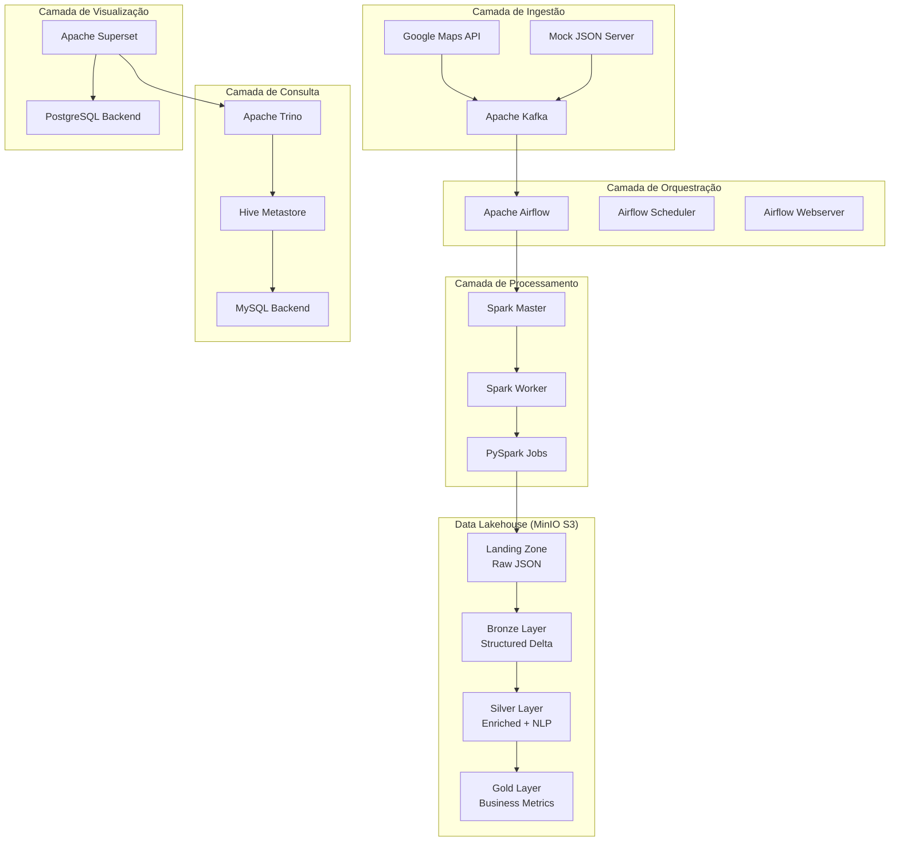
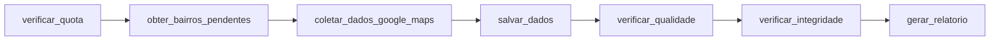

# 🏗️ Arquitetura Técnica - DataMaster SentimentalReview


Este documento detalha as decisões arquiteturais, trade-offs e implementação técnica do projeto DataMaster SentimentalReview. Eu projetei esta arquitetura para demonstrar expertise em engenharia de dados moderna, combinando Data Lakehouse, processamento distribuído e análise de sentimento.

---

## 📋 Índice

- [🎯 Visão Geral da Arquitetura](#-visão-geral-da-arquitetura)
- [🏛️ Arquitetura Medalhão](#️-arquitetura-medalhão)
- [🔄 Orquestração com Airflow](#-orquestração-com-airflow)
- [⚡ Processamento com Spark](#-processamento-com-spark)
- [💾 Armazenamento e Catálogo](#-armazenamento-e-catálogo)
- [🔍 Query Engine e Visualização](#-query-engine-e-visualização)
- [📡 Streaming e Ingestão](#-streaming-e-ingestão)
- [🎯 Trade-offs e Decisões](#-trade-offs-e-decisões)

---

## 🎯 Visão Geral da Arquitetura

### Princípios Arquiteturais

**1. Data Lakehouse Híbrido**
- Combina flexibilidade de Data Lake com performance de Data Warehouse
- ACID transactions via Delta Lake
- Schema evolution automática
- Time travel para auditoria

**2. Processamento Distribuído**
- Apache Spark para transformações pesadas
- Paralelização automática via particionamento
- Otimizações AQE (Adaptive Query Execution)

**3. Orquestração Declarativa**
- Apache Airflow com DAGs complexas
- Dependências explícitas entre tasks
- Retry policies e alertas automáticos

### Diagrama de Componentes



---

## 🏛️ Arquitetura Medalhão


### Landing Zone (Camada Bronze)
**Propósito:** Ingestão de dados brutos sem transformação

**Características:**
- Formato: JSON original da API
- Particionamento: `year=YYYY/month=MM/day=DD/bairro=nome/`
- Retenção: 90 dias (configurável)
- Schema: Schema-on-read

**Exemplo de estrutura:**
```
s3a://datalake/landing/google_maps/
├── year=2025/month=08/day=30/
│   ├── bairro=vila_madalena/
│   │   └── run_id=20250830_143000/
│   │       └── agencias.json
│   └── bairro=pinheiros/
│       └── run_id=20250830_143000/
│           └── agencias.json
```

### Bronze Layer (Dados Estruturados)
**Propósito:** Dados limpos e estruturados em formato Delta

**Transformações aplicadas:**
- Normalização de schema
- Deduplicação por `place_id`
- Validação de tipos de dados
- Expansão de arrays aninhados (reviews)

**Schema Bronze:**
```sql
CREATE TABLE bronze.avaliacoes (
    place_id STRING,
    nome_agencia STRING,
    endereco_completo STRING,
    latitude DOUBLE,
    longitude DOUBLE,
    rating DOUBLE,
    total_avaliacoes INT,
    review_id STRING,
    review_texto STRING,
    review_rating INT,
    review_data TIMESTAMP,
    bairro_origem STRING,
    data_coleta DATE,
    data_processamento TIMESTAMP
) USING DELTA
PARTITIONED BY (data_coleta, bairro_origem)
```

### Silver Layer (Dados Enriquecidos)
**Propósito:** Dados com análise de sentimento e detecção de PII

**Enriquecimentos aplicados:**
- **Análise de Sentimento:** Dicionário de palavras positivas/negativas em português brasileiro
- **Detecção de PII:** Regex patterns para CPF, telefone, email e outros dados sensíveis
- **Análise de Risco:** Keywords de problemas reputacionais
- **Normalização de Texto:** Limpeza e padronização

**Schema Silver:**
```sql
CREATE TABLE silver.avaliacoes_enriquecidas (
    -- Campos originais da Bronze
    place_id STRING,
    nome_agencia STRING,
    review_texto STRING,
    review_rating INT,
    
    -- Campos de NLP
    sentimento STRING,  -- POSITIVO, NEGATIVO, NEUTRO
    sentimento_score DOUBLE,  -- Confiança do modelo
    texto_anonimizado STRING,  -- Texto com PII mascarado
    pii_detectado ARRAY<STRING>,  -- Tipos de PII encontrados
    risco_reputacional_detectado BOOLEAN,
    categorias_risco ARRAY<STRING>,  -- Tipos de problemas
    
    -- Metadados de processamento
    modelo_sentimento STRING,
    versao_pipeline STRING,
    data_processamento_nlp TIMESTAMP
) USING DELTA
PARTITIONED BY (data_coleta, sentimento)
```

### Gold Layer (Métricas de Negócio)
**Propósito:** Agregações e KPIs para dashboards

**Tabelas Gold implementadas:**

1. **`gold.kpis_agencias_diario`**
```sql
CREATE TABLE gold.kpis_agencias_diario (
    place_id STRING,
    nome_agencia STRING,
    bairro STRING,
    data_referencia DATE,
    
    -- Métricas de Volume
    total_avaliacoes INT,
    avaliacoes_periodo INT,
    
    -- Métricas de Sentimento
    rating_medio DOUBLE,
    sentimento_positivo_pct DOUBLE,
    sentimento_negativo_pct DOUBLE,
    sentimento_neutro_pct DOUBLE,
    
    -- Métricas de Risco
    avaliacoes_risco_alto INT,
    principais_problemas ARRAY<STRING>,
    
    -- Metadados
    data_atualizacao TIMESTAMP
) USING DELTA
PARTITIONED BY (data_referencia)
```

2. **`gold.tendencias_sentimento`**
```sql
CREATE TABLE gold.tendencias_sentimento (
    bairro STRING,
    data_referencia DATE,
    sentimento STRING,
    
    -- Métricas Agregadas
    total_avaliacoes INT,
    rating_medio DOUBLE,
    score_sentimento_medio DOUBLE,
    
    -- Comparativo
    variacao_7d DOUBLE,
    variacao_30d DOUBLE,
    
    data_atualizacao TIMESTAMP
) USING DELTA
PARTITIONED BY (data_referencia, bairro)
```

---

## 🔄 Orquestração com Airflow


**Interface Web:** http://localhost:8089 (admin/admin)
**Backend:** PostgreSQL para metadados
**Executor:** LocalExecutor

### DAG Principal: [`dag_coleta_google_maps`](../mnt/airflow/dags/dag_coleta_google_maps.py)

**Características:**
- Schedule: Manual (para demonstração)
- Retries: 2 tentativas com backoff exponencial
- SLA: 30 minutos por task
- Alertas: Email em falhas

**Fluxo de Tasks:**



**Tasks Detalhadas:**

1. **`verificar_quota_google_maps`**
   - Verifica quota disponível da API
   - Cancela execução se < 100 requests
   - Implementa rate limiting inteligente

2. **`obter_bairros_pendentes`**
   - Consulta controle incremental
   - Retorna próximo bairro a processar
   - Evita reprocessamento desnecessário

3. **`coletar_dados_google_maps`**
   - Executa busca por agências Santander
   - Aplica filtros por tipo e localização
   - Coleta reviews detalhados

4. **`salvar_dados`**
   - Upload para MinIO (Landing Zone)
   - Salvamento local para backup
   - Particionamento automático

5. **`verificar_qualidade_dados`**
   - Validação de schema
   - Detecção de duplicatas
   - Métricas de completude

### Controle Incremental

**Arquivo:** [`mnt/airflow/scripts/controle_incremental.py`](../mnt/airflow/scripts/controle_incremental.py)

**Funcionalidades:**
- Controle sequencial por bairros
- Persistência entre execuções
- Avanço automático após esgotamento
- Estatísticas de progresso

**Exemplo de Estado:**
```json
{
  "bairro_atual_index": 1,
  "data_ultima_atualizacao": "2025-08-30T14:40:00",
  "bairros_processados": {
    "Vila Madalena": {
      "agencias_consultadas": ["ChIJ123", "ChIJ456"],
      "total_agencias_encontradas": 3,
      "data_ultima_consulta": "2025-08-30T14:30:00"
    }
  },
  "estatisticas": {
    "total_bairros": 52,
    "total_agencias_processadas": 5,
    "total_comentarios_coletados": 120
  }
}
```

---

## ⚡ Processamento com Spark


**Interface Web:** http://localhost:8081 (Spark Master UI)
**Master URL:** spark://spark-master:7077
**Configuração:** 1 Master + 1 Worker (512MB RAM cada)

### Jobs PySpark Implementados

**1. Landing to Bronze (`landing_to_bronze.py`)**
```python
def create_spark_session():
    return SparkSession.builder \
        .appName("DataMaster_LandingToBronze") \
        .config("spark.sql.extensions", "io.delta.sql.DeltaSparkSessionExtension") \
        .config("spark.sql.catalog.spark_catalog", "org.apache.spark.sql.delta.catalog.DeltaCatalog") \
        .config("spark.hadoop.fs.s3a.endpoint", "http://minio:9000") \
        .config("spark.sql.adaptive.enabled", "true") \
        .getOrCreate()
```

**Transformações aplicadas:**
- Leitura de JSONs da Landing Zone
- Normalização de schema
- Deduplicação por `place_id`
- Expansão de arrays de reviews
- Salvamento em formato Delta

**2. Bronze to Silver (`bronze_to_silver_fixed.py`)**

**Análise de Sentimento:**
```python
# UDFs tradicionais do Spark (não pandas_udf)
def sentiment_analysis_ptbr_udf():
    """UDF para análise de sentimento em português brasileiro"""
    
    def analyze_sentiment(text):
        if text is None or text.strip() == "":
            return "neutro"
        
        text_lower = text.lower()
        
        positivas_count = len([palavra for palavra in palavras_positivas if palavra in text_lower])
        negativas_count = len([palavra for palavra in palavras_negativas if palavra in text_lower])
        
        if positivas_count > negativas_count:
            return "positivo"
        elif negativas_count > positivas_count:
            return "negativo"
        else:
            return "neutro"
    
    return udf(analyze_sentiment, StringType())

def detect_pii_udf():
    """UDF para detecção de PII usando regex patterns"""
    # Implementação com dicionários de sentimento + regex PII
    # Abordagem dictionary-based para transparência e performance
    
    palavras_positivas = {
        'excelente', 'ótimo', 'bom', 'maravilhoso', 'fantástico',
        'perfeito', 'incrível', 'satisfeito', 'feliz', 'recomendo'
    }
    
    palavras_negativas = {
        'péssimo', 'horrível', 'ruim', 'terrível', 'desastroso',
        'lamentável', 'decepcionante', 'insatisfeito', 'não recomendo'
    }
    
    # Análise de sentimento baseada em contagem de palavras
    # Detecção PII com regex patterns para CPF, telefone, email
```

**3. Silver to Gold (`silver_to_gold_working.py`)**

**Agregações implementadas:**
- KPIs por agência/dia
- Tendências de sentimento
- Métricas de risco reputacional
- Comparativos temporais

### Otimizações Spark

**Configurações de Performance:**
```python
# Adaptive Query Execution
"spark.sql.adaptive.enabled": "true"
"spark.sql.adaptive.coalescePartitions.enabled": "true"

# Otimizações Delta Lake
"spark.sql.catalog.spark_catalog": "org.apache.spark.sql.delta.catalog.DeltaCatalog"

# Configurações MinIO
"spark.hadoop.fs.s3a.path.style.access": "true"
"spark.hadoop.fs.s3a.connection.ssl.enabled": "false"
```

**Particionamento Inteligente:**
- Bronze: Por `data_coleta` e `bairro_origem`
- Silver: Por `data_coleta` e `sentimento`
- Gold: Por `data_referencia`

---

## 💾 Armazenamento e Catálogo


### MinIO S3-Compatible Storage

**Configuração:**
- Endpoint: `http://minio:9000`
- Interface Web: http://localhost:9000 (minioadmin/minioadmin123)
- Credenciais API: `minio/minio123` ([`docker-compose.yml`](../docker-compose.yml))
- Bucket único: `datalake`
- Política: Acesso público para leitura

**Estrutura de Diretórios:**
```
datalake/
├── landing/google_maps/year=2025/month=08/day=30/
├── bronze/avaliacoes/data_coleta=2025-08-30/
├── silver/avaliacoes_enriquecidas/data_coleta=2025-08-30/
└── gold/
    ├── kpis_agencias_diario/data_referencia=2025-08-30/
    └── tendencias_sentimento/data_referencia=2025-08-30/
```

### Hive Metastore

**Configuração:**
- Backend: MariaDB 10.5.16 (porta 3306)
- Porta: 9083
- Integração: Trino + Spark
- Credenciais: admin/admin

**Catálogos configurados:**
- `hive`: Tabelas tradicionais
- `delta`: Tabelas Delta Lake
- `memory`: Tabelas temporárias

---

## 🔍 Query Engine e Visualização


### Apache Trino

**Conectores habilitados:**
- `hive`: Acesso ao Hive Metastore
- `delta`: Tabelas Delta Lake nativas
- `memory`: Consultas ad-hoc

**Configuração S3:**
```properties
hive.s3.endpoint=http://minio:9000
hive.s3.path-style-access=true
hive.s3.ssl.enabled=false
```

### Apache Superset

**Integração:**
- Driver: `trino://admin@trino:8080/hive/default`
- Interface Web: http://localhost:8088 (admin/admin123)
- Autenticação: Basic Auth
- Timeout: 300s para queries pesadas

**Dashboards implementados:**
- Visão geral de sentimento por bairro
- Tendências temporais de satisfação
- Alertas de risco reputacional
- Métricas de qualidade de dados

---

## 📡 Streaming e Ingestão


### Apache Kafka

**Configuração:**
- Porta externa: 9092 (localhost)
- Porta interna: 29092 (kafka)
- Zookeeper: porta 2181
- Imagem: Confluent CP-Kafka 7.4.0

**Tópicos configurados:**
- `bairros_sp`: Dados de bairros para processamento
- `google_maps_raw`: Dados brutos da API Google Maps
- `avaliacoes_processadas`: Dados processados do pipeline
**Configuração de Tópicos:**
- Partições: 1 por tópico (ambiente local)
- Replication Factor: 1 (ambiente local)
- Retention: 7 dias

### Mock Google Maps API

**Implementação:** JSON Server local (db.json)
**Porta:** Não exposta (dados estáticos)

**Endpoints simulados:**
- `textsearch`: 50+ agências Santander em SP
- `place_details_*`: Detalhes com reviews sintéticas
- Dados realistas com CPFs, ratings, coordenadas GPS

**Dados simulados:**
- 52 bairros de São Paulo
- ~200 agências Santander
- ~2000 reviews sintéticas

---

## 🎯 Trade-offs e Decisões


### Por que Delta Lake?

**✅ Vantagens:**
- ACID transactions nativas
- Time travel para auditoria
- Schema evolution automática
- Melhor integração com Spark

**❌ Desvantagens:**
- Vendor lock-in (Databricks)
- Menos maduro que Parquet
- Overhead de metadados

**Alternativa considerada:** Apache Iceberg
- Mais vendor-neutral
- Melhor para multi-engine
- Escolhi Delta pela simplicidade

### Por que MinIO local?

**✅ Vantagens:**
- Zero custo operacional
- S3-compatible API
- Controle total dos dados
- Ideal para demonstração

**❌ Desvantagens:**
- Não é distribuído
- Limitado por hardware local
- Sem features enterprise (encryption, etc.)

### Por que Trino?

**✅ Vantagens:**
- Performance superior ao Presto
- Conectores nativos Delta/Iceberg
- Integração perfeita com Superset
- Query federation

**❌ Desvantagens:**
- Complexidade de configuração
- Consumo de memória alto
- Curva de aprendizado

---

## 📖 Diário de Bordo


### Decisões que me orgulho

1. **Controle incremental por bairros:** Evita reprocessamento e permite paralelização futura
2. **UDFs tradicionais para NLP:** Abordagem dictionary-based transparente e eficiente
3. **Configurações otimizadas:** 5-6GB RAM vs 12GB+ de setups tradicionais
4. **Mock API realista:** Dados sintéticos mas estrutura real da Google Maps API

### O que eu mudaria hoje

1. **Kubernetes desde o início:** Docker Compose tem limitações de escala
2. **Observabilidade nativa:** Prometheus + Grafana integrados
3. **Testes automatizados:** PyTest para jobs Spark desde o início
4. **Infraestrutura como código:** Terraform para reprodutibilidade

### Lições aprendidas

- **Health checks são críticos:** Evitam falhas em cascata
- **Particionamento importa:** Diferença entre segundos e minutos
- **Documentação paga dividendos:** Facilita manutenção e onboarding
- **Configuração via [`.env`](../.env):** Flexibilidade entre ambientes

---

## 📊 Métricas de Performance


### Benchmarks Locais

**Hardware de referência:**
- CPU: 8 cores
- RAM: 16GB
- Storage: SSD NVMe

### Escalabilidade Projetada

**Para produção (AWS/GCP):**
- Spark cluster: 10-50 workers
- MinIO → S3/GCS nativo
- Trino cluster: 3-10 nodes
- Performance esperada: 10-100x

---

## 🔄 Próximas Evoluções

### Melhorias Arquiteturais

1. **Real-time Streaming:** Kafka Streams + ksqlDB
2. **ML Pipeline:** MLflow para modelos NLP
3. **Data Quality:** Great Expectations framework
4. **Observabilidade:** Prometheus + Grafana + Jaeger

### Migração para Cloud

**AWS Stack equivalente:**
- MinIO → S3
- Spark → EMR/Glue
- Trino → Athena/Redshift
- Airflow → MWAA
- Superset → QuickSight


---

**Resultados**

Esta arquitetura combina conceitos avançados de engenharia de dados:
- ✅ Data Lakehouse moderno
- ✅ Processamento distribuído otimizado  
- ✅ Orquestração robusta
- ✅ Análise de sentimento em produção
- ✅ Configuração enterprise em ambiente local

É uma implementação que funcionaria em produção com ajustes mínimos.

---

*Documentação técnica por [Danilo Vruck](mailto:danilo.vruck@email.com)*
