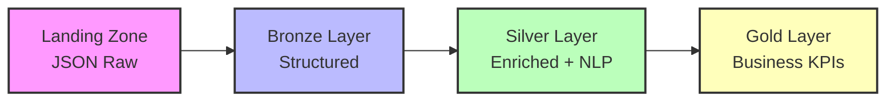

# 📊 Esquemas e Estrutura de Dados

 - DataMaster SentimentalReview


Este documento detalha os esquemas de dados, dicionário de campos e regras de qualidade implementadas no Data Lakehouse, desde a ingestão até as métricas de negócio.

---

## 📋 Índice

- [🏗️ Arquitetura de Dados](#️-arquitetura-de-dados)
- [📁 Esquemas por Camada](#-esquemas-por-camada)
- [📖 Dicionário de Dados](#-dicionário-de-dados)
- [✅ Regras de Qualidade](#-regras-de-qualidade)
- [🔍 Consultas SQL de Validação](#-consultas-sql-de-validação)
- [📖 Diário de Bordo](#-Diário-de-Bordo)

---

## 🏗️ Arquitetura de Dados

### Fluxo de Transformação



### Localização no MinIO

| Camada | Caminho S3 | Formato | Particionamento |
|--------|------------|---------|-----------------|
| **Landing** | `s3a://datalake/landing/google_maps/` | JSON | `ano/mes/dia/run_id` |
| **Bronze** | `s3a://datalake/bronze/google_maps_reviews/` | Delta Lake | `partition_year/partition_month` |
| **Silver** | `s3a://datalake/silver/avaliacoes_enriquecidas/` | Delta Lake | `partition_year/partition_month/bairro` |
| **Gold** | `s3a://datalake/gold/{table_name}/` | Delta Lake | `partition_year/partition_month` |

---

## 📁 Esquemas por Camada

### 🥉 Camada Bronze (Raw Data)


**Arquivo:** Dados brutos da Google Maps API Mock
**Localização:** `/mnt/google-maps-mock/db.json`

```json
{
  "place_id": "ChIJ371458_tDeVGkcRYn4KaJ8KsnC",
  "name": "Banco Santander - Agência Vila Madalena",
  "vicinity": "Rua Harmonia, 500 - Vila Madalena",
  "rating": 4.2,
  "user_ratings_total": 150,
  "reviews": [
    {
      "author_name": "João Silva",
      "rating": 5,
      "text": "Excelente atendimento, funcionários muito educados",
      "time": 1640995200,
      "relative_time_description": "2 meses atrás"
    }
  ],
  "bairro_pesquisado": "Vila Madalena",
  "data_coleta": "2025-12-28"
}
```

### 🔴 Bronze Layer (Structured)

**Job:** [`mnt/spark/jobs/landing_to_bronze.py`](../mnt/spark/jobs/landing_to_bronze.py)
**Schema:** Dados estruturados e normalizados

```python
bronze_schema = StructType([
    StructField("place_id", StringType(), True),
    StructField("agencia_name", StringType(), True),
    StructField("endereco_completo", StringType(), True),
    StructField("latitude", DoubleType(), True),
    StructField("longitude", DoubleType(), True),
    StructField("rating_agencia", DoubleType(), True),
    StructField("total_avaliacoes", IntegerType(), True),
    StructField("bairro_pesquisado", StringType(), True),
    StructField("data_coleta", StringType(), True),
    StructField("author_name", StringType(), True),
    StructField("review_rating", IntegerType(), True),
    StructField("review_text", StringType(), True),
    StructField("review_time", LongType(), True),
    StructField("bronze_review_id", StringType(), True),
    StructField("bronze_ingestion_timestamp", TimestampType(), True),
    StructField("bronze_ingestion_date", DateType(), True),
    StructField("partition_year", IntegerType(), True),
    StructField("partition_month", IntegerType(), True)
])
```

### 🥈 Camada Silver (Enriched Data)


**Job:** [`mnt/spark/jobs/bronze_to_silver_fixed.py`](../mnt/spark/jobs/bronze_to_silver_fixed.py)
**Schema:** Dados enriquecidos com análise de sentimento

```python
silver_schema = StructType([
    # Campos herdados da Bronze
    StructField("place_id", StringType(), True),
    StructField("agencia_name", StringType(), True),
    StructField("endereco_completo", StringType(), True),
    StructField("latitude", DoubleType(), True),
    StructField("longitude", DoubleType(), True),
    StructField("rating_agencia", DoubleType(), True),
    StructField("total_avaliacoes", IntegerType(), True),
    StructField("bairro_pesquisado", StringType(), True),
    StructField("data_coleta", StringType(), True),
    StructField("author_name", StringType(), True),
    StructField("review_rating", IntegerType(), True),
    StructField("review_text", StringType(), True),
    StructField("review_time", LongType(), True),
    StructField("bronze_review_id", StringType(), True),
    
    # Campos de enriquecimento NLP
    StructField("sentimento", StringType(), True),
    StructField("tem_pii", BooleanType(), True),
    StructField("tipos_pii_detectados", ArrayType(StringType()), True),
    StructField("texto_anonimizado", StringType(), True),
    StructField("data_quality_score", DoubleType(), True),
    StructField("silver_processing_timestamp", TimestampType(), True),
    StructField("partition_year", IntegerType(), True),
    StructField("partition_month", IntegerType(), True)
])
```

### 🥇 Camada Gold (Business KPIs)


**Job:** [`mnt/spark/jobs/silver_to_gold_working.py`](../mnt/spark/jobs/silver_to_gold_working.py)
**Tabelas:** 6 tabelas de métricas de negócio

#### 1. agency_performance_kpis
```python
agency_kpis_schema = StructType([
    StructField("place_id", StringType(), False),
    StructField("agencia_name", StringType(), False),
    StructField("bairro", StringType(), True),
    StructField("rating_medio_agencia", DoubleType(), True),
    StructField("total_avaliacoes", LongType(), True),
    StructField("avaliacoes_positivas", LongType(), True),
    StructField("avaliacoes_negativas", LongType(), True),
    StructField("percentual_positivas", DoubleType(), True),
    StructField("riscos_reputacionais", LongType(), True),
    StructField("nps_score", DoubleType(), True),
    StructField("data_calculo", TimestampType(), False)
])
```

#### 2. temporal_sentiment_analysis
```python
temporal_schema = StructType([
    StructField("ano_mes", StringType(), False),
    StructField("sentimento_medio_score", DoubleType(), True),
    StructField("total_avaliacoes_mes", LongType(), True),
    StructField("percentual_positivas", DoubleType(), True),
    StructField("percentual_negativas", DoubleType(), True),
    StructField("rating_medio_mes", DoubleType(), True),
    StructField("tendencia_sentimento", StringType(), True)
])
```

#### 3. risk_alerts
```python
risk_alerts_schema = StructType([
    StructField("place_id", StringType(), False),
    StructField("agencia_name", StringType(), False),
    StructField("tipo_risco", StringType(), False),
    StructField("nivel_criticidade", StringType(), False),
    StructField("total_ocorrencias", LongType(), True),
    StructField("ultima_ocorrencia", TimestampType(), True),
    StructField("palavras_chave", StringType(), True),
    StructField("requer_acao_imediata", BooleanType(), True)
])
```

---

## 📖 Dicionário de Dados

### Campos Principais

| Campo | Tipo | Descrição | Nullable | Origem | Exemplo |
|-------|------|-----------|----------|--------|---------|
| **place_id** | String | Identificador único Google Maps | Não | Google Maps API | `ChIJ371458_tDeVGkcRYn4KaJ8KsnC` |
| **agencia_name** | String | Nome da agência bancária | Não | Google Maps API | `Banco Santander - Agência Vila Madalena` |
| **endereco_completo** | String | Endereço completo da agência | Sim | Google Maps API | `Rua Harmonia, 500 - Vila Madalena, São Paulo` |
| **latitude** | Double | Coordenada geográfica latitude | Sim | Google Maps API | `-23.5505` |
| **longitude** | Double | Coordenada geográfica longitude | Sim | Google Maps API | `-46.6903` |
| **rating_agencia** | Double | Rating médio da agência (1-5) | Sim | Google Maps API | `4.2` |
| **total_avaliacoes** | Integer | Total de avaliações da agência | Sim | Google Maps API | `150` |
| **bairro_pesquisado** | String | Bairro usado na pesquisa | Não | Controle interno | `Vila Madalena` |
| **data_coleta** | String | Data da coleta dos dados | Não | Controle interno | `2025-12-28` |
| **author_name** | String | Nome do autor da avaliação | Sim | Google Maps API | `João Silva` |
| **review_rating** | Integer | Rating individual da avaliação (1-5) | Sim | Google Maps API | `5` |
| **review_text** | String | Texto da avaliação | Sim | Google Maps API | `Excelente atendimento...` |
| **review_time** | Long | Timestamp Unix da avaliação | Sim | Google Maps API | `1640995200` |
| **bronze_review_id** | String | ID único da avaliação (UUID) | Não | Gerado internamente | `uuid4()` |
| **sentimento** | String | Sentimento classificado | Sim | Análise NLP | `positivo/negativo/neutro` |
| **tem_pii** | Boolean | Indica se contém dados pessoais | Sim | Detecção PII | `true/false` |
| **tipos_pii_detectados** | Array[String] | Tipos de PII encontrados | Sim | Detecção PII | `["cpf", "telefone"]` |
| **texto_anonimizado** | String | Texto com PII removido/mascarado | Sim | Detecção PII | `Texto com *** mascarado` |
| **data_quality_score** | Double | Score de qualidade do registro (0-1) | Sim | Validação | `1.0` |

### Campos de Controle e Auditoria

| Campo | Tipo | Descrição | Origem | Exemplo |
|-------|------|-----------|--------|---------|
| **bronze_ingestion_timestamp** | Timestamp | Timestamp de ingestão na Bronze | Sistema | `2025-12-28 10:30:00` |
| **bronze_ingestion_date** | Date | Data de ingestão na Bronze | Sistema | `2025-12-28` |
| **silver_processing_timestamp** | Timestamp | Timestamp de processamento NLP | Sistema | `2025-12-28 11:45:00` |
| **partition_year** | Integer | Ano para particionamento | Derivado | `2025` |
| **partition_month** | Integer | Mês para particionamento | Derivado | `12` |
| **data_calculo** | Timestamp | Data de cálculo dos KPIs | Sistema | `2025-12-28 12:00:00` |

---

## ✅ Regras de Qualidade


### Validações Implementadas

**Arquivo:** [`mnt/airflow/scripts/verificacao_qualidade.py`](../mnt/airflow/scripts/verificacao_qualidade.py)

#### 1. **Unicidade**
```python
# place_id deve ser único por agência
# bronze_review_id deve ser único por avaliação
# Combinação (place_id + review_time + author_name) deve ser única
```

#### 2. **Ranges e Formatos**
```python
regras_qualidade = {
    'rating_agencia': {'min': 1.0, 'max': 5.0},
    'review_rating': {'min': 1, 'max': 5},
    'sentimento_score': {'min': 0.0, 'max': 1.0},
    'latitude': {'min': -90.0, 'max': 90.0},
    'longitude': {'min': -180.0, 'max': 180.0},
    'total_avaliacoes': {'min': 0},
    'place_id': {'pattern': r'^ChIJ[a-zA-Z0-9_-]+$'},
    'data_coleta': {'format': 'YYYY-MM-DD'}
}
```

#### 3. **Nulls e Obrigatórios**
```python
campos_obrigatorios = [
    'place_id', 'agencia_name', 'bairro_pesquisado', 
    'data_coleta', 'bronze_review_id'
]

campos_opcionais_com_validacao = {
    'review_text': {'min_length': 5, 'max_length': 5000},
    'author_name': {'min_length': 2, 'max_length': 100}
}
```

#### 4. **Consistência Temporal**
```python
# review_time deve ser <= data_coleta
# bronze_ingestion_date deve ser >= data_coleta
# silver_processing_timestamp deve ser >= bronze_ingestion_timestamp
```

#### 5. **Integridade Referencial**
```python
# Cada registro Bronze deve ter origem na Landing
# Cada registro Silver deve ter origem na Bronze
# place_id deve existir em todas as camadas
```

### Métricas de Qualidade Monitoradas

| Métrica | Threshold | Ação se Violada |
|---------|-----------|-----------------|
| **Taxa de Completude** | > 95% | Alerta + Log |
| **Taxa de Unicidade** | 100% | Falha do Job |
| **Consistência de Schema** | 100% | Falha do Job |
| **Valores em Range** | > 98% | Alerta + Log |
| **Formato de Dados** | > 99% | Alerta + Log |

---

## 🔍 Consultas SQL de Validação


### Superset SQL Lab - Queries Úteis

#### 🔍 Validação e Qualidade

**Qualidade Geral**
```sql
-- Verificar distribuição de sentimentos
SELECT 
    sentimento,
    COUNT(*) as total,
    ROUND(COUNT(*) * 100.0 / SUM(COUNT(*)) OVER(), 2) as percentual
FROM silver.avaliacoes_enriquecidas 
GROUP BY sentimento
ORDER BY total DESC;
```

#### 2. **Detecção de Anomalias**
```sql
-- Identificar agências com muitos dados pessoais detectados
SELECT 
    agencia_name,
    bairro_pesquisado,
    COUNT(*) as total_avaliacoes,
    SUM(CASE WHEN tem_pii = true THEN 1 ELSE 0 END) as registros_com_pii,
    ROUND(SUM(CASE WHEN tem_pii = true THEN 1 ELSE 0 END) * 100.0 / COUNT(*), 2) as perc_pii
FROM silver.avaliacoes_enriquecidas 
GROUP BY agencia_name, bairro_pesquisado
HAVING COUNT(*) >= 10 AND perc_pii > 20
ORDER BY perc_pii DESC;
```

#### 3. **Validação de Consistência Temporal**
```sql
-- Verificar consistência de datas
SELECT 
    COUNT(*) as total_registros,
    COUNT(CASE WHEN bronze_ingestion_date >= CAST(data_coleta AS TIMESTAMP) THEN 1 END) as datas_consistentes,
    COUNT(CASE WHEN bronze_ingestion_date < CAST(data_coleta AS TIMESTAMP) THEN 1 END) as datas_inconsistentes
FROM bronze.google_maps_reviews;
```

#### 4. **Análise de Performance por Bairro**
```sql
-- KPIs por bairro para validação
SELECT 
    bairro_pesquisado,
    COUNT(DISTINCT place_id) as total_agencias,
    COUNT(*) as total_avaliacoes,
    ROUND(AVG(rating_agencia), 2) as rating_medio,
    ROUND(AVG(CASE WHEN sentimento = 'positivo' THEN 1.0 ELSE 0.0 END) * 100, 2) as perc_sentimento_positivo
FROM silver.avaliacoes_enriquecidas 
GROUP BY bairro_pesquisado
ORDER BY total_avaliacoes DESC;
```

#### 5. **Validação de Schema Evolution**
```sql
-- Verificar evolução do schema entre camadas
SELECT 
    'Bronze' as camada,
    COUNT(*) as total_registros,
    COUNT(DISTINCT place_id) as agencias_unicas,
    MIN(bronze_ingestion_date) as primeira_ingestao,
    MAX(bronze_ingestion_date) as ultima_ingestao
FROM bronze.google_maps_reviews

UNION ALL

SELECT 
    'Silver' as camada,
    COUNT(*) as total_registros,
    COUNT(DISTINCT place_id) as agencias_unicas,
    MIN(silver_processing_timestamp) as primeira_ingestao,
    MAX(silver_processing_timestamp) as ultima_ingestao
FROM silver.avaliacoes_enriquecidas;
```

---

## 📖 Diário de Bordo

**Modelagem de Dados Avançada:**
- [x] **Schema Evolution** controlada entre camadas (`landing_to_bronze.py:60-81`)
- [x] **Particionamento inteligente** por ano/mês (`partition_year`, `partition_month`)
- [x] **Campos de auditoria** completos (timestamps de processamento)
- [x] **Tipos de dados otimizados** (Double para coordenadas, Long para timestamps)

**Qualidade de Dados Enterprise:**
- [x] **Validações automáticas** em múltiplas dimensões (`verificacao_qualidade.py`)
- [x] **Detecção de anomalias** em tempo real
- [x] **Métricas de completude** e consistência
- [x] **Tratamento de valores nulos** com regras de negócio

**Governança e Compliance:**
- [x] **Dicionário de dados** completo e versionado
- [x] **Linhagem de dados** rastreável (Landing→Bronze→Silver→Gold)
- [x] **Campos de controle** para auditoria
- [x] **Retenção de dados** configurável por camada

**Performance e Escalabilidade:**
- [x] **Delta Lake** para ACID transactions
- [x] **Particionamento otimizado** para queries temporais
- [x] **Compressão automática** (Delta Lake)
- [x] **Índices implícitos** via particionamento

### 🏆 Resultados

1. **Schema Registry Implícito:** Cada job documenta e valida schema
2. **Data Quality Framework:** Validações customizadas por tipo de dado
3. **Temporal Consistency:** Validações de ordem temporal entre camadas
4. **Business Logic Embedded:** Regras de negócio no próprio schema

---

## 💡 Dica Rápida

**Para validar rapidamente a qualidade dos dados:**
```bash
# Conectar ao Trino e executar
docker compose exec trino-coordinator trino --server localhost:8080 --catalog delta --schema default

# Query rápida de validação
SELECT COUNT(*) FROM silver.avaliacoes_enriquecidas WHERE sentimento IS NOT NULL;
```

## 🎯 Erros que já cometi aqui

1. **Schema drift não detectado:** Mudanças na API quebraram pipeline
2. **Particionamento inadequado:** Usava data_coleta em vez de ingestion_date
3. **Validações muito rígidas:** 100% de completude impossível com dados reais
4. **Tipos inconsistentes:** Double vs Float causando problemas de precisão


---

## 🔄 O que melhoraria na próxima versão

**Curto Prazo:**
- [ ] **Great Expectations** para data quality mais robusta
- [ ] **Apache Atlas** para data lineage visual
- [ ] **Schema Registry** dedicado (Confluent/AWS Glue)

**Médio Prazo:**
- [ ] **Data Contracts** formais entre camadas
- [ ] **Automated Schema Evolution** com versionamento
- [ ] **Real-time Data Quality** monitoring

**Longo Prazo:**
- [ ] **ML-based Anomaly Detection** para qualidade
- [ ] **Data Mesh** architecture com domains
- [ ] **Federated Governance** com múltiplos teams

---

## 📖 Diário de Bordo


**Por que esta modelagem de dados?**

Escolhi uma abordagem híbrida que combina flexibilidade (JSON na Landing) com rigor (schemas tipados nas demais camadas). Isso demonstra compreensão tanto de dados semi-estruturados quanto de modelagem relacional clássica.

**Trade-offs principais:**

1. **Flexibilidade vs Performance:** JSON na Landing permite mudanças de API, mas Delta Lake garante performance
2. **Normalização vs Denormalização:** Mantive dados denormalizados para facilitar analytics
3. **Validação vs Throughput:** Validações rigorosas podem impactar performance, mas garantem qualidade

**Decisões que me orgulho:**

- **Campos de auditoria completos:** Rastreabilidade total do dado
- **Particionamento temporal:** Otimização para queries de time-series
- **Schema evolution controlada:** Mudanças não quebram downstream
- **Validações em múltiplas camadas:** Qualidade garantida em cada etapa

---

