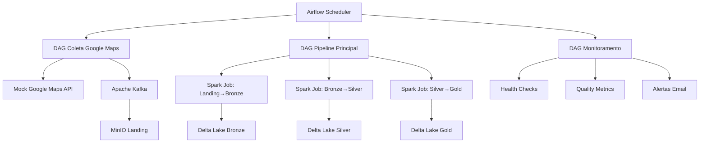
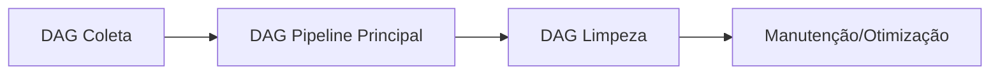

# 🔄 Pipeline e DAGs


Este documento detalha a orquestração completa do pipeline de dados, desde a coleta até a análise de sentimentos, usando Apache Airflow como motor de orquestração.

---

## 📋 Índice

- [🎯 Visão Geral do Pipeline](#-visão-geral-do-pipeline)
- [🔧 DAGs Implementadas](#-dags-implementadas)
- [⚡ Jobs Spark](#-jobs-spark)
- [🔧 Troubleshooting](#-troubleshooting)
- [🔄 Fluxo de Execução](#-fluxo-de-execução)
- [📊 Monitoramento e Alertas](#-monitoramento-e-alertas)

---

##  Visão Geral do Pipeline


### Arquitetura de Orquestração



### Camadas do Data Lakehouse

| Camada | Formato | Descrição | Retenção |
|--------|---------|-----------|----------|
| **Landing** | JSON | Dados brutos da API | 30 dias |
| **Bronze** | Delta Lake | Dados estruturados | 90 dias |
| **Silver** | Delta Lake | Dados enriquecidos com NLP | 2 anos |
| **Gold** | Delta Lake | KPIs e métricas agregadas | 5 anos |

---

## 📅 DAGs Implementados


### 1. DAG Coleta Google Maps ([`dag_coleta_google_maps.py`](../mnt/airflow/dags/dag_coleta_google_maps.py))

**Objetivo:** Coletar avaliações de agências Santander via Google Maps API

**Schedule:** Manual (on-demand)

**Tasks:**
```python
verificar_quota_google_maps >> obter_bairros_pendentes >> coletar_dados_google_maps >> 
salvar_dados >> verificar_qualidade_dados >> verificar_integridade_completa >> 
gerar_relatorio_final
```

**Configurações principais:**
```python
default_args = {
    'owner': 'engenharia-dados',
    'depends_on_past': False,
    'start_date': days_ago(1),
    'email_on_failure': True,
    'email_on_retry': False,
    'retries': 2,
    'retry_delay': timedelta(minutes=5),
    'catchup': False
}
```

### 2. DAG Pipeline Principal ([`datamaster_pipeline_dag_fixed.py`](../mnt/airflow/dags/datamaster_pipeline_dag_fixed.py))

**Objetivo:** Processar dados através das camadas medalhão

**Schedule:** Manual (on-demand)

**Tasks:**
```python
start_pipeline >> preprocessing_group >> main_processing_group >> 
post_processing_group >> end_pipeline
```

**BashOperators (Execução Direta no Container Spark):**
```python
landing_to_bronze = BashOperator(
    task_id='landing_to_bronze',
    bash_command='''
    docker exec spark-master /opt/spark/bin/spark-submit \
        --packages io.delta:delta-core_2.12:2.4.0 \
        --conf "spark.sql.extensions=io.delta.sql.DeltaSparkSessionExtension" \
        --conf "spark.sql.catalog.spark_catalog=org.apache.spark.sql.delta.catalog.DeltaCatalog" \
        --conf "spark.hadoop.fs.s3a.endpoint=http://minio:9000" \
        --conf "spark.hadoop.fs.s3a.access.key=minio" \
        --conf "spark.hadoop.fs.s3a.secret.key=minio123" \
        /opt/bitnami/spark/jobs/landing_to_bronze.py
    '''
)
```

### 3. DAG Limpeza ([`cleanup_datalake_dag.py`](../mnt/airflow/dags/cleanup_datalake_dag.py))

**Objetivo:** Limpeza e manutenção do Data Lakehouse

**Schedule:** Semanal

**Tasks:**
- `cleanup_landing_layer`
- `cleanup_bronze_layer` 
- `optimize_delta_tables`
- `vacuum_old_files`

---

## ⚙️ Configurações dos Jobs


### Configurações Principais

```python
default_args = {
    'owner': 'engenharia-dados',
    'depends_on_past': False,
    'start_date': days_ago(1),
    'email_on_failure': True,
    'email_on_retry': False,
    'retries': 2,
    'retry_delay': timedelta(minutes=5),
    'catchup': False
}
```

---

## ⚡ Jobs Spark


### 1. Landing to Bronze ([`landing_to_bronze.py`](../mnt/spark/jobs/landing_to_bronze.py))

**Função:** Estruturar dados JSON brutos em formato Delta Lake

```python
def ingest_landing_to_bronze(spark, landing_path, bronze_path):
    """Ingere dados da landing para Bronze com processamento completo"""
    
    # Configurar Spark para Delta Lake
    spark.conf.set("spark.sql.extensions", "io.delta.sql.DeltaSparkSessionExtension")
    spark.conf.set("spark.sql.catalog.spark_catalog", "org.apache.spark.sql.delta.catalog.DeltaCatalog")
    
    # Ler dados JSON da Landing
    df_landing = spark.read.option("multiline", "true").json(landing_path)
    
    # Aplicar transformações e schema
    df_bronze = df_landing.select(
        col("place_id").alias("agencia_id"),
        col("name").alias("nome_agencia"), 
        col("rating").cast("double").alias("rating_agencia"),
        col("total_user_ratings_count").alias("total_avaliacoes"),
        explode(col("reviews")).alias("review_data")
    )
    
    # Salvar em formato Delta Lake
    df_bronze.write.format("delta").mode("overwrite").save(bronze_path)
```

### 2. Bronze to Silver ([`bronze_to_silver_fixed.py`](../mnt/spark/jobs/bronze_to_silver_fixed.py))

**Função:** Enriquecer dados com análise de sentimentos e detecção de PII

```python
def sentiment_analysis_ptbr_udf():
    """UDF para análise de sentimento em português brasileiro"""
    
    def analyze_sentiment(text):
        if text is None or text.strip() == "":
            return "neutro"
        
        text_lower = text.lower()
        
        positivas_count = len([palavra for palavra in palavras_positivas if palavra in text_lower])
        negativas_count = len([palavra for palavra in palavras_negativas if palavra in text_lower])
        
        if positivas_count > negativas_count:
            return "positivo"
        elif negativas_count > positivas_count:
            return "negativo"
        else:
            return "neutro"
    
    return udf(analyze_sentiment, StringType())

def detect_pii_udf():
    """UDF para detecção de PII usando regex"""
    
    def detect_pii(text):
        if text is None or text.strip() == "":
            return (False, [], text)
        
        pii_detected = []
        anonymized_text = text
        
        # CPF, Email, Telefone patterns
        if re.search(r'\b\d{3}\.?\d{3}\.?\d{3}-?\d{2}\b', text):
            pii_detected.append("cpf")
            anonymized_text = re.sub(r'\b\d{3}\.?\d{3}\.?\d{3}-?\d{2}\b', '[CPF_ANONIMIZADO]', anonymized_text)
        
        return (len(pii_detected) > 0, pii_detected, anonymized_text)
    
    return udf(detect_pii, StructType([
        StructField("tem_pii", BooleanType(), True),
        StructField("tipos_pii", ArrayType(StringType()), True),
        StructField("texto_anonimizado", StringType(), True)
    ]))
```

### 3. Silver to Gold ([`silver_to_gold_working.py`](../mnt/spark/jobs/silver_to_gold_working.py))

**Função:** Gerar KPIs e métricas de negócio

```python
def gerar_kpis_negocio(df_silver):
    # KPIs por agência
    kpis_agencia = df_silver.groupBy("agencia_id", "nome_agencia").agg(
        avg("rating").alias("rating_medio"),
        count("*").alias("total_avaliacoes"),
        sum(when(col("sentimento") == "POSITIVE", 1).otherwise(0)).alias("avaliacoes_positivas"),
        sum(when(col("risco_reputacional") == "ALTO", 1).otherwise(0)).alias("riscos_altos")
    )
    
    # Tendências temporais
    tendencias = df_silver.groupBy(
        date_format("data_avaliacao", "yyyy-MM").alias("mes_ano")
    ).agg(
        avg("rating").alias("rating_medio_mensal"),
        avg("sentimento_score").alias("sentimento_medio_mensal")
    )
    
    return kpis_agencia, tendencias
```

---

## 🔧 Troubleshooting


### Dicas de Solução de Problemas

1. **Verificar logs**: Airflow, Spark, MinIO
2. **Testar DAGs**: Manualmente, via Airflow UI
3. **Revisar configurações**: DAGs, Jobs Spark, Airflow

---

## 🔄 Fluxo de Execução


### Sequência Típica de Execução

1. **Trigger Manual ou Automático**
   ```bash
   # Via Airflow UI ou API
   curl -X POST "http://localhost:8089/api/v1/dags/dag_coleta_google_maps/dagRuns"
   ```

2. **Coleta de Dados**
   - Verificação de quota API
   - Seleção de bairros pendentes
   - Coleta via Google Maps API
   - Envio para Kafka
   - Persistência em MinIO Landing

3. **Processamento Spark**
   - Landing → Bronze: Estruturação
   - Bronze → Silver: Enriquecimento NLP
   - Silver → Gold: Agregações

4. **Validação e Qualidade**
   - Verificação de integridade
   - Métricas de qualidade
   - Alertas automáticos

### Dependências entre DAGs



---

## 📊 Monitoramento e Alertas


### Métricas Coletadas

| Métrica | Descrição | Threshold |
|---------|-----------|-----------|
| **Taxa de Sucesso** | % de tasks bem-sucedidas | > 95% |
| **Latência Média** | Tempo médio de execução | < 30 min |
| **Qualidade de Dados** | % registros válidos | > 98% |
| **Uso de Recursos** | CPU/RAM Spark | < 80% |

### Alertas Configurados

```python
def verificar_anomalias():
    # Verificar falhas recorrentes
    falhas = get_dag_run_failures(last_n_days=1)
    if falhas > 3:
        send_alert("Múltiplas falhas detectadas")
    
    # Verificar qualidade dos dados
    qualidade = calculate_data_quality()
    if qualidade < 0.95:
        send_alert(f"Qualidade baixa: {qualidade:.2%}")
    
    # Verificar latência
    latencia = get_average_task_duration()
    if latencia > timedelta(minutes=45):
        send_alert(f"Alta latência: {latencia}")
```

### Dashboard de Monitoramento

**Métricas em Tempo Real:**
- Status das DAGs
- Execuções recentes
- Qualidade dos dados
- Performance do cluster Spark

**Acesso:** http://localhost:8089 (Airflow UI)

---

## 📖 Diário de Bordo

### Decisões Arquiteturais

**Por que Airflow LocalExecutor?**
- Simplicidade para ambiente local
- Menor overhead que CeleryExecutor
- Adequado para volume de dados atual

**Por que BashOperator com docker exec?**
- Execução direta no container Spark
- Evita problemas de conectividade Airflow-Spark
- Controle total sobre configurações Spark

**Por que controle incremental por arquivo?**
- Resiliência a falhas
- Facilita reprocessamento
- Auditoria completa

### Otimizações Implementadas

1. **Retry com Backoff Exponencial**
2. **Health Checks Automáticos**
3. **Particionamento Inteligente**
4. **Cache de Modelos NLP**
5. **Compressão Delta Lake**

### Lições Aprendidas

- **Sempre validar conectividade** entre containers
- **Configurar timeouts generosos** para primeira execução
- **Implementar idempotência** em todos os jobs
- **Monitorar recursos Spark** continuamente

---

